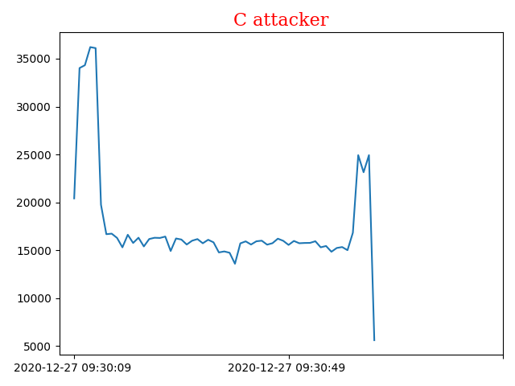
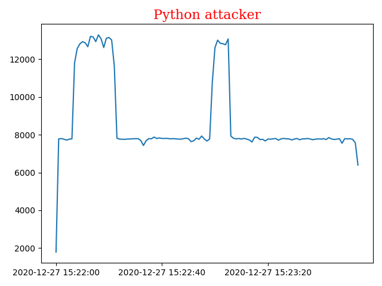
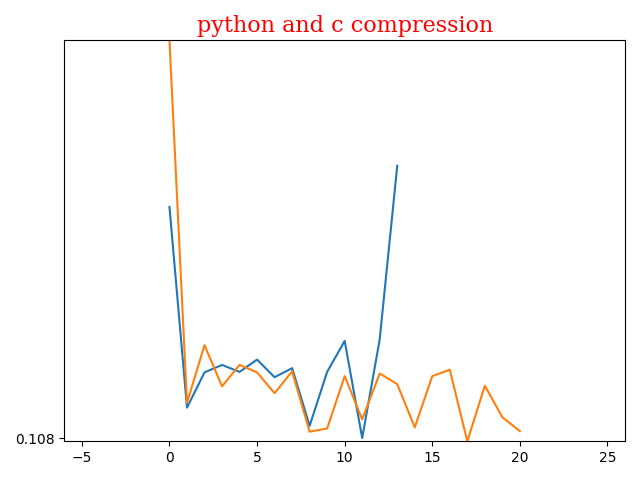

# dos

firt of all I udes scapy for the dos atack .
but scapy is a very slow and because it was impractical 
I decited to used raw socket in python in a si,ilar yaw to c . 

# average for c is 0.27157142857142863 and std is 0.13642198937001862
# average for c is 0.22047619047619052 and std is 0.14984710272478188

# c graph 

# python graph 

# c and python graph 

# wireshark python

# wireshark c

