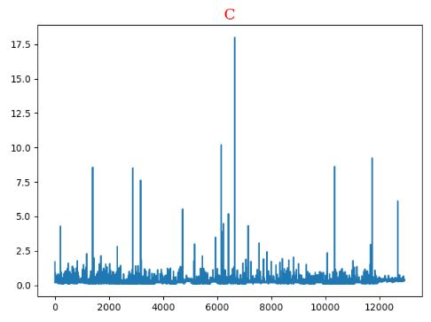
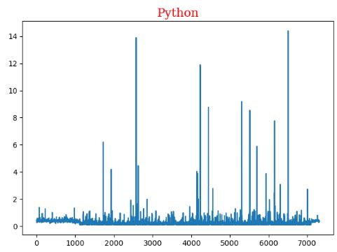
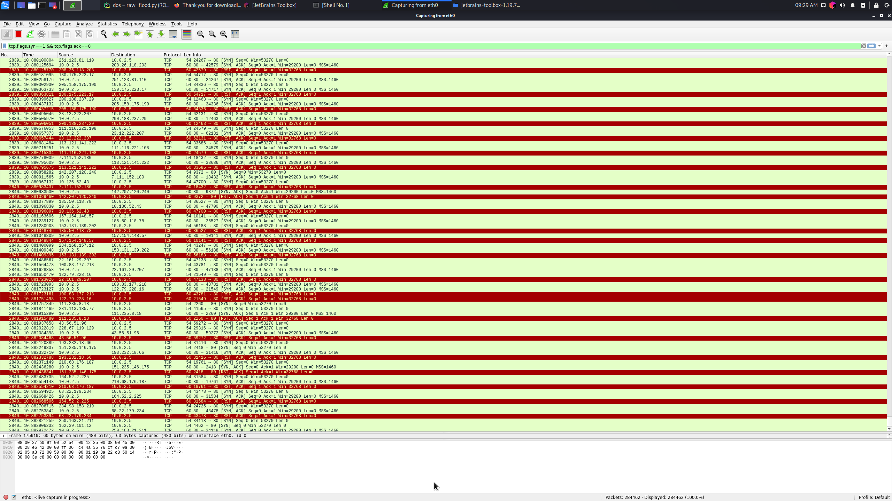
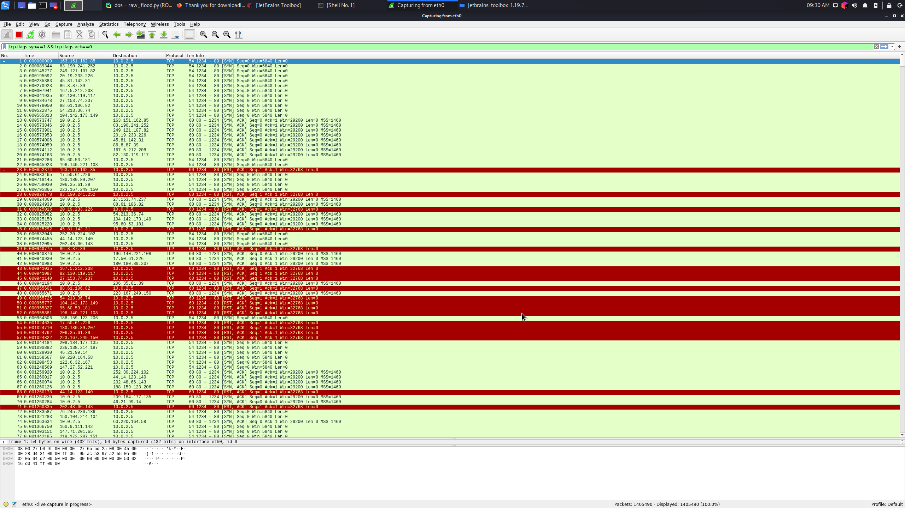

# dos

firt of all I udes scapy for the dos atack .
but scapy is a very slow and because it was impractical 
I decited to used raw socket in python in a si,ilar yaw to c . 

## average for c is 0.27669578336557055 and std is 0.31182203422878235
## average for c is 0.2490501846027622 and std is 0.393249362623316

# c graph 

# python graph 

# c and python graph 

# wireshark python

# wireshark c

